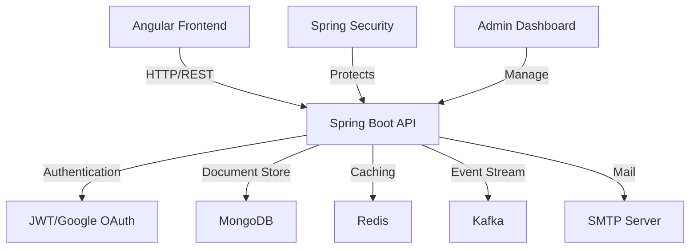
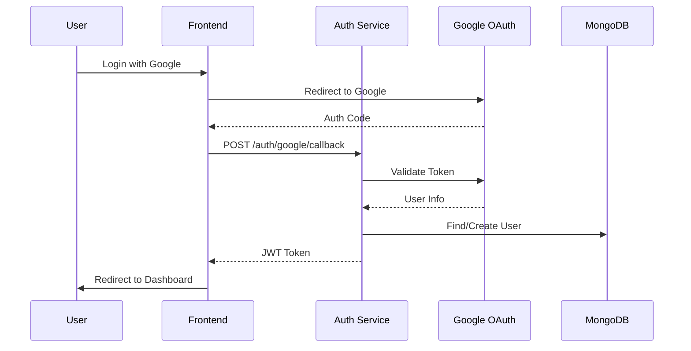
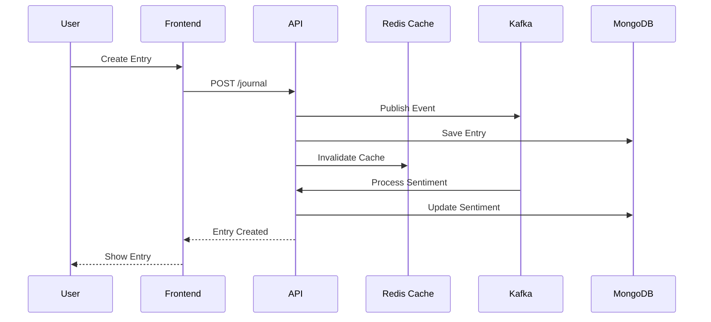

# JournalApp

A full-stack personal journal application that enables users to create and manage daily entries with rich text formatting, sentiment analysis, and Google authentication integration. The application uses a microservices architecture with Redis caching, Kafka event streaming, and MongoDB for data persistence.

## 🌟 Features

- **Authentication**

  - JWT-based authentication
  - Google OAuth integration
  - Role-based access control (User/Admin)

- **Journal Management**

  - CRUD operations for entries
  - Rich text editing with TinyMCE
  - Sentiment analysis for entries
  - Real-time updates

- **System Features**
  - Redis caching
  - Kafka event streaming
  - MongoDB document storage
  - Email notifications
  - Health monitoring

## 🛠️ Tech Stack

### Frontend

- Angular 19
- TinyMCE Editor
- Angular Material
- RxJS
- TypeScript

### Backend

- Java 17
- Spring Boot 3.x
- Spring Security with JWT
- Spring Data MongoDB
- Spring Kafka
- Spring Data Redis
- Spring Mail

### Database & Cache

- MongoDB
- Redis Cache
- Kafka Message Broker

### DevOps

- Maven
- Git
- Docker
- JWT

## 🏗️ System Architecture



## 🔄 Authentication Flow



## 🔄 Journal Entry Flow



## 📡 API Endpoints

### Authentication

| Method | Endpoint                | Description           |
| ------ | ----------------------- | --------------------- |
| POST   | `/public/login`         | User login            |
| POST   | `/public/signup`        | User registration     |
| GET    | `/auth/google/callback` | Google OAuth callback |

### Journal Entries

| Method | Endpoint             | Description     |
| ------ | -------------------- | --------------- |
| GET    | `/journal`           | Get all entries |
| GET    | `/journal/id/{myId}` | Get entry by ID |
| POST   | `/journal`           | Create entry    |
| PUT    | `/journal/id/{myId}` | Update entry    |
| DELETE | `/journal/id/{myId}` | Delete entry    |

### Admin Operations

| Method | Endpoint                   | Description       |
| ------ | -------------------------- | ----------------- |
| GET    | `/admin/all-users`         | Get all users     |
| POST   | `/admin/create-admin-user` | Create admin      |
| GET    | `/admin/clear_cache`       | Clear Redis cache |

## 🚀 Setup Instructions

### Prerequisites

- Java 17+
- Node.js 19+
- MongoDB
- Redis
- Kafka
- Maven 3.8+

### Backend Setup

```bash
# Clone repository
git clone https://github.com/yourusername/journalapp.git

# Navigate to backend
cd journalapp

# Install dependencies
mvn clean install

# Run application
mvn spring-boot:run
```

### Frontend Setup

```bash
# Navigate to frontend
cd journal-ui

# Install dependencies
npm install

# Run development server
ng serve
```


## ⚠️ Error Handling

- **Authentication**

  - JWT validation and refresh
  - Google OAuth error handling
  - Role-based access control

- **Data Operations**

  - MongoDB transaction management
  - Cache synchronization
  - Kafka retry mechanisms

- **System**
  - Global exception handling
  - API error responses
  - Client-side error boundaries

---